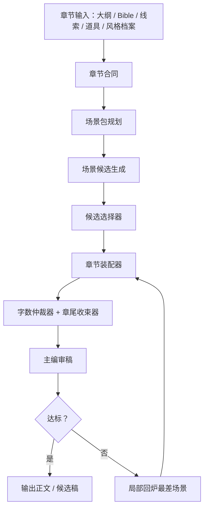

# Story Studio Pipeline 设计：展示优先的小说生成流水线

## 背景

当前 PP 的小说生成已经具备章节策略、场景预算、风格手法库、主编审稿、长稿母本和字数收束器，但真实链路验证显示：单纯“去 AI 味提示词”只能带来有限改善。更稳定的方向不是要求模型“写得像人”，而是把“好看”拆成可执行、可检查、可回炉的生产流程。

本设计目标是把章节生成从“一口气写一章”升级为“章节制片流水线”：先定章节合同，再拆场景包，再生成候选、筛选、装配、审稿和局部回炉。

## 核心原则：展示优先写作协议

展示优先协议是本方案的硬约束，不是附加提示词。

- 少解释，多展示。
- 少总结，多动作和细节。
- 少金句，多具体反应。
- 不直接写“复杂情绪”，改写人物做了什么、停顿了什么、避开了什么。
- 对话不要每句都完整、礼貌、逻辑闭环。
- 人物不能都像同一个聪明客服，必须有各自的信息盲区、说话习惯和不合作方式。

该协议会进入三个位置：

1. 章节合同：明确本章哪些情绪、信息和动机不能直说。
2. 场景包：给每个场景分配可见动作、潜台词对白、未说出口的情绪。
3. 主编审稿与回炉：对解释、总结、情绪命名、客服式对白做扣分和局部修正。

## 目标

1. 提升章节可读性：冲突更清楚，人物更有差异，读者更愿意追下一章。
2. 控制字数：目标字数默认控制在 ±8%。
3. 避免硬截断：结尾必须以自然钩子收束。
4. 减少 AI 味的可感知来源：解释句、总结句、抽象情绪、礼貌闭环对白、段尾升华句。
5. 保留现有 PP 能力，不重做架构，不破坏常规生成按钮。

## 非目标

- 不继续以 AI 检测器分数作为主目标。
- 不把每章都交给昂贵模型多轮整章重写。
- 不让局部问题触发整章重写。
- 不引入全新的小说数据库结构，优先复用现有章节策略、风格库、候选稿、主编审稿和工作流。

## 总体流程



## 组件设计

### 1. Chapter Contract：章节合同

章节合同是正文生成前的硬约束对象。它不写正文，只回答本章要完成什么。

字段：

- `chapter_question`：本章读者想知道的问题。
- `protagonist_want`：主角当前想拿到什么、确认什么或避免什么。
- `opposition`：谁或什么阻碍主角。
- `reader_expectation`：读者期待看到的具体场面。
- `required_information_change`：本章必须新增或改变的信息。
- `required_relationship_change`：本章必须发生的人物关系变化。
- `ending_question`：章末留下的追问。
- `show_dont_tell_rules`：本章禁止直说的情绪、动机和解释。

示例：

```json
{
  "chapter_question": "灰卡的写入设备是否还在系统内部？",
  "protagonist_want": "白雨翔想证明 774 写卡器未被正常销毁。",
  "opposition": "许照保留关键证据，督导科流程也在误导他。",
  "required_information_change": "签收记录从嫌疑证据变成伪造证据。",
  "required_relationship_change": "白雨翔和许照从对抗变成有限合作。",
  "ending_question": "操盘者是否借用了内部审计流程？",
  "show_dont_tell_rules": [
    "不能写白雨翔感到怀疑，只能写他追问、停顿、扣住证物不交。",
    "不能解释许照开始信任白雨翔，只能写他让出半步、交出一份次级证据。",
    "对白不能每句完整回答，允许打断、反问、避重就轻。"
  ]
}
```

### 2. Scene Package：场景包

每章拆成 3-5 个场景包。场景包是字数和可读性的基本单位。

字段：

- `label`：场景名。
- `target_words`：本场景预算。
- `goal`：角色在此场景要达成什么。
- `resistance`：阻力。
- `information_shift`：信息如何变化。
- `relationship_shift`：人物关系如何变化。
- `visible_action`：必须出现的具体动作。
- `subtext_dialogue`：对白表面内容和真实意图。
- `unspoken_emotion`：不能直说的情绪。
- `object_or_clue_change`：道具或线索状态变化。
- `scene_hook`：场景末的小钩子。

场景包规划必须让 `target_words` 总和接近章节目标字数。最后一个场景包由字数仲裁器动态调整预算，避免最后硬裁。

### 3. Candidate Generator：场景候选生成

每个场景包默认生成 1 个候选。关键章或用户开启“质量优先”时生成 2 个候选。

候选生成只负责写当前场景，不负责整章。输入包括：

- 章节合同
- 当前场景包
- 已选前文尾段
- Bible / CoC 正典 / 线索 / 道具账本
- 风格档案与展示优先协议

候选生成的硬要求：

- 场景必须发生具体行动。
- 对话必须存在潜台词或信息不对称。
- 不允许用总结句跳过冲突过程。
- 不允许把未说出口的情绪命名出来。
- 不允许段尾金句式升华。

### 4. Candidate Selector：候选选择器

候选选择器只做判断，不重写正文。可使用分析模型，默认 DS。

评分维度：

- 冲突是否可见。
- 信息是否发生变化。
- 人物关系是否发生变化。
- 对白是否有潜台词。
- 动作是否承载情绪。
- 是否出现解释句、总结句、抽象情绪、客服式对白。
- 是否符合场景字数预算。

输出：

- `selected_candidate_id`
- `score`
- `reasons`
- `rewrite_flags`

### 5. Chapter Assembler：章节装配器

章节装配器把选中的场景候选拼为一章，并负责过渡。

装配规则：

- 不重写已选正文的大段内容。
- 只补必要的场景过渡句。
- 检查人物、线索、道具、认知边界是否连续。
- 记录每个场景的最终字数和预算偏差。

如果拼接后超预算，优先压缩解释句、重复环境和段尾总结，不压缩冲突动作与关键对白。

### 6. Word Budget Arbiter：字数仲裁器

字数仲裁器不在最后硬截断，而是在三个阶段介入：

1. 场景包规划阶段：分配预算。
2. 场景候选阶段：控制单场景输出。
3. 章节装配阶段：动态调整最后一个场景和结尾收束长度。

规则：

- 默认章节容差 ±8%。
- 低于下限：优先补动作链、反应、阻力升级、信息确认过程。
- 高于上限：优先删解释、总结、重复环境、抽象情绪。
- 接近上限：只允许自然收束，不新增设定。

### 7. Ending Closer：章尾收束器

章尾收束器只处理最后 200-400 字。

目标：

- 保留追读钩子。
- 不新增大设定。
- 不用“他知道事情才刚刚开始”这类模板句。
- 让最后一句来自一个具体动作、物件、声音、短信、脚步、门、证据变化或对话断点。

### 8. Editorial Review：主编审稿

审稿继续使用现有维度，但新增展示优先检查。

评分：

- 开篇
- 冲突
- 人物
- 对白
- 追读
- 节奏
- 展示优先

展示优先扣分项：

- 解释句过密。
- 总结句替代场景。
- 直接命名情绪。
- 对白完整礼貌且闭环。
- 人物声音趋同。
- 段尾升华或金句。

### 9. Local Reroll：局部回炉

如果审稿不达标，不整章重写，只回炉最差的 1-2 个场景包。

回炉输入：

- 原场景包
- 原候选正文
- 审稿问题
- 章节合同
- 前后场景边界

回炉动作：

- 把解释改成动作。
- 把情绪词改成身体反应。
- 把完整对白打碎。
- 增加不合作、停顿、误解、抢话、答非所问。
- 保持剧情事实、线索状态和道具状态不变。

## 与现有系统的集成

### 后端

优先扩展 `AutoNovelGenerationWorkflow`，不新建并行大工作流。

现有能力复用：

- `generate_chapter_strategy`：升级为章节合同 + 场景包规划。
- `_resolve_scene_budget_plan`：继续做场景预算基础。
- `_build_prompt`：注入展示优先协议和场景包。
- `_enforce_chapter_word_target`：保留为兜底，但减少硬截断依赖。
- `review_generated_chapter_editorially`：增加展示优先评分。
- 候选稿 API：承载场景候选和局部回炉结果。

### 前端

默认生成按钮保留。新增设置尽量少：

- 默认模式：章节制片流水线。
- 质量优先：每场景 2 候选，成本更高。
- 长稿母本：继续灰度开关。

工作台展示：

- 章节合同预览。
- 场景包列表。
- 每个场景的预算/实际字数。
- 审稿结果和局部回炉按钮。

### 模型路由

- 写作正文：跟随后台当前写作模型配置。
- 合同、场景包、候选选择、审稿：默认分析模型 DS。
- 质量优先候选生成：仍使用写作模型，但只在用户开启时增加调用次数。

## 错误处理

- 章节合同 JSON 解析失败：回退为保守合同模板，并记录 warning。
- 场景包总预算偏差超过 15%：重新归一化预算，不重新调用模型。
- 单场景候选为空：重试一次；仍失败则回退为单候选生成。
- 候选选择器失败：选择字数最接近且禁忌项最少的候选。
- 装配后超预算：运行字数仲裁器；仍超出时提示用户生成候选稿，不自动覆盖正文。
- CoC 正典或认知边界阻断：保留现有硬阻断，不进入正文生成。

## 测试方案

### 单元测试

- 章节合同包含展示优先规则。
- 场景包预算总和接近目标字数。
- 候选选择器能扣除解释句、总结句和情绪命名。
- 局部回炉不会改变线索和道具状态。
- 章尾收束器不会新增设定。

### 集成测试

- `generate-chapter-stream` 默认可返回章节合同、场景包和 done。
- 质量优先模式会生成多候选并选择一版。
- 长稿母本模式继续返回 `long_draft_mode` 和拆章数。
- 主编审稿返回 `展示优先` 分数。

### 人工抽检

使用同一大纲生成 3 组：

- 旧默认链路。
- 章节制片流水线。
- 质量优先流水线。

对比指标：

- 字数命中：目标 ±8%。
- 追读分：>= 90。
- 主编总均分：>= 88。
- 展示优先分：>= 85。
- 人工读感：对白是否像不同人、是否少解释多动作。

## 分阶段落地

### 阶段一：最小可用流水线

- 章节合同。
- 场景包规划。
- 展示优先协议注入。
- 场景预算 + 章尾收束。
- 主编审稿增加展示优先评分。

### 阶段二：候选选择

- 每场景 2 候选。
- 候选选择器。
- 质量优先开关。
- 候选评分记录。

### 阶段三：局部回炉

- 根据主编审稿定位最差场景。
- 只回炉局部。
- 装配后重新审稿。

### 阶段四：长稿母本增强

- 长稿按场景峰值拆章。
- 每章重写结尾钩子。
- 保留下一章前摄设定。

## 验收标准

- 目标字数 ±8% 命中率 >= 90%。
- 主编审稿平均分 >= 88。
- 追读分 >= 90。
- 展示优先分 >= 85。
- 章尾突兀人工判定 <= 10%。
- 人工抽检中“人物像同一个声音”的比例明显下降。

## 结论

本方案不再把问题定义为“降低 AI 味”，而是定义为“让正文通过可见动作、具体细节、潜台词对白和人物差异来推进”。它保留现有 PP 能力，并把章节策略、场景预算、风格库、主编审稿和候选稿系统串成一条可验证的生成流水线。

